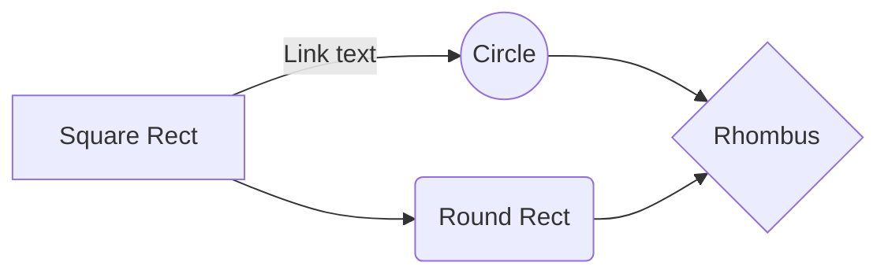

# cde

```mermaid
graph LR
A[Square Rect] -- Link text --> B((Circle))
A --> C(Round Rect)
B --> D{Rhombus}
C --> D
```
<table border="1"><tr><td>
<pre>
**Hello**,

_world_.
</pre>
</td></tr></table>

