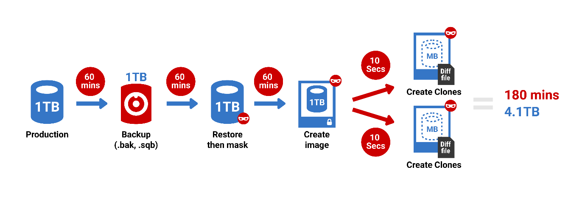

# Red-Gate SQL Provision

## Physical & Network Requirements

* Sql Clone Server
   - Creates DB to track images and clones
   - File Share to store clones (virtualized) and images using instlaled Sql Server and point in time copies of the db
   - Installs the Agent (worker) responsible for creating images and clones
   - Clone UI - web server port 80
   - Clone Server port 14146 must be open
* Clone Agents
    - manages clones
* Install on high bandwidth LAN - otherwise latency causes connectivity disruption

## Security

* Identify account that runs Sql Clone Server
    - Does not require Server Admin but does need access to its own confiruation files and to listen on port 14146.
    - Sql Clone server user must have access to the disk area where clones & images are written. Best practice is to be an admin of the server.
* Identify account tha truns SQl Clone Agent
   - Needs Admin to mount disk and manage db clones. (sysadmin fixed role)

## Clone Database & Software Maintenance
1. Sql Clone Sql Server Database
    * Backup Schedule
    * Backup Retention Policy
    * Software Upgrade Procedure

## Image Creation & Cloning Procedure
1. Map out security
1. Install Sql Provision on Server
1. Source datbase must be masked, so apply mask
1. Create an Image from source db (scs_auto_gsfs) using web UI 
1. Create a clone from Image using web UI
1. Test access to the clone

## Clone Maintenance
1. Identify retention requirements prior to gen'ing a clone
2. Itentify 

## Reference Diagram

